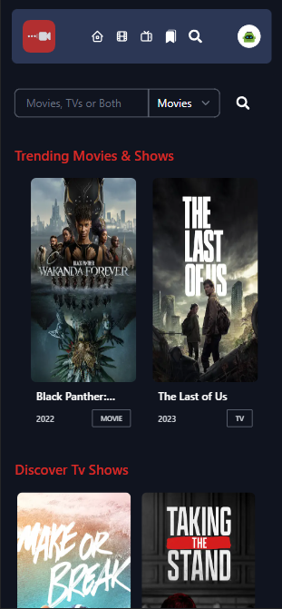
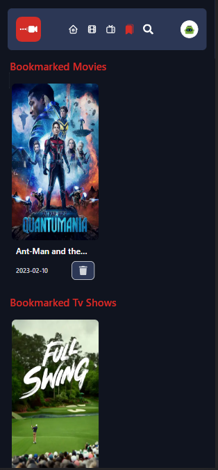
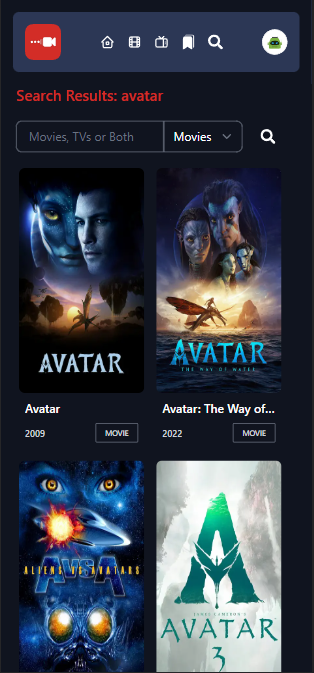
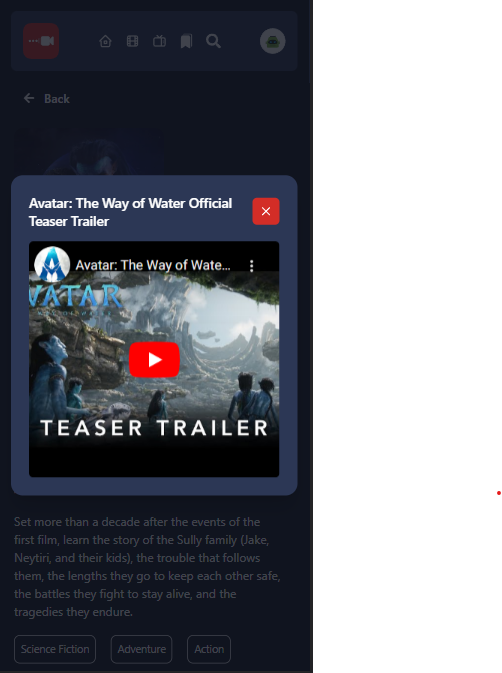

# Cine Stream

Broswe for your next Movie or Tv Show.

## Tech Stack

### Backend

* [Next.js 13 Beta](https://beta.nextjs.org/docs)
  * [app directory](https://beta.nextjs.org/docs/routing/fundamentals)
  * [server components](https://beta.nextjs.org/docs/rendering/server-and-client-components)
* [DynamoDB](https://docs.aws.amazon.com/sdk-for-javascript/v3/developer-guide/dynamodb-example-dynamodb-utilities.html)
* [NextAuth](https://next-auth.js.org/getting-started/example)

### Frontend
* [tailwind.css](https://tailwindcss.com/)
* [react-toastify](https://fkhadra.github.io/react-toastify/introduction)
* [react-icons](https://react-icons.github.io/react-icons/)

### Shared

* [react](https://reactjs.org/)
* [Typescript](https://www.typescriptlang.org/)

### Features
* View curated list of movies/shows from home, movies, tvs page.
* Search for a movie or show through the search bar and learn more by going to dynamic details page.
* Sign in with Google and create and delete movies and shows from your personal list or details page. 

### API Reference
* [The Movie Database](https://developers.themoviedb.org/3/getting-started/introduction)

### Small Preview

